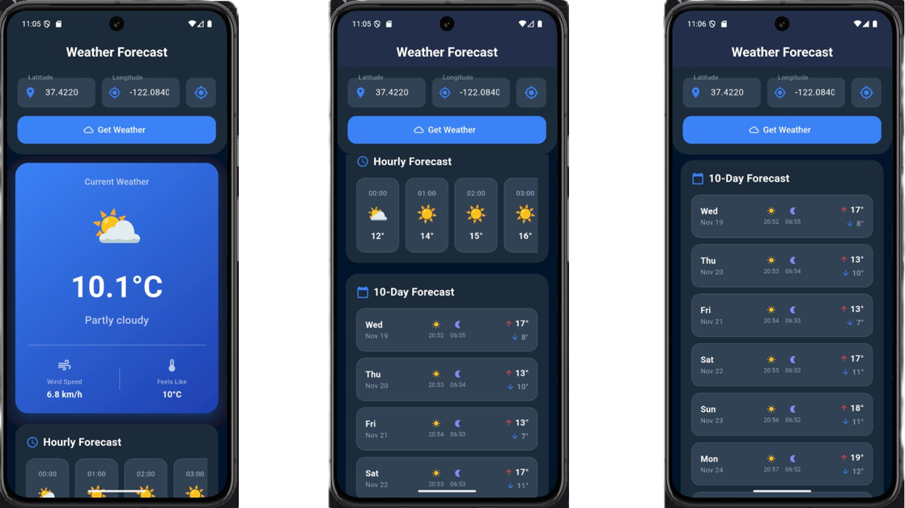

# 🌦️ Weather App

A simple and modern Flutter weather application that shows **current weather**, **hourly forecast**, and a **10-day forecast** based on latitude and longitude.
Designed with a clean UI for quick, accurate weather updates.

- [Lab: Write your first Flutter app](https://docs.flutter.dev/get-started/codelab)
- [Cookbook: Useful Flutter samples](https://docs.flutter.dev/cookbook)

For help getting started with Flutter development, view the
[online documentation](https://docs.flutter.dev/), which offers tutorials,
samples, guidance on mobile development, and a full API reference.
